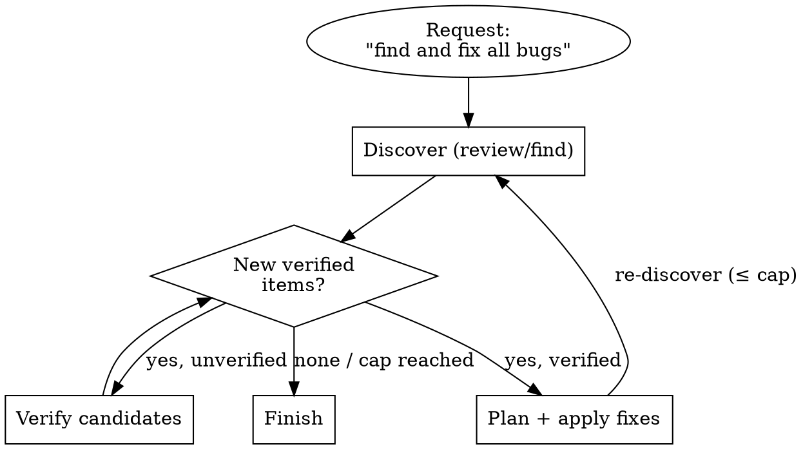

# Design: Orchestrator Diligence — Complete Coverage as a Structural Guarantee

## Context

An earlier experiment (branch `archive/programmatic-workflow-runtime`) replaced this framework with
a programmatic **workflow runtime**: the orchestrator emitted the *entire* task as a phase-graph
program before any subagent ran, and a runtime executed it with journaled resume. The integration
cost outweighed the benefit and the experiment was abandoned back to `master`. But it enforced one
property worth keeping: **diligence** — because you had to author the whole graph up front, no part
of the request could be silently dropped, and the natural graph shape invited verification and
refinement nodes. The agent *wanted to do more*.

This design imports that **property** into master's native idiom (the `orchestrate` lifecycle +
`.docs/rules` + existing gate machinery) **without** the runtime. It is deliberately *not* a port of
the abandoned implementation.

**The problem it solves:** master today has the *scaffolding* for diligence — the R0.5 Approach
Proposal, the critique/review/dogfood gates — but nothing **forces** a complete, part-by-part
accounting of the request before work begins, and the proportionality instinct (Quick lane, "trivial
→ minimal") actually pushes the other way. On a multi-part request ("implement X and Y") nothing
structurally prevents "did X, quietly forgot Y."

**Load-bearing constraint — the orchestrator is a weak free model.** The framework's whole thesis is
"guaranteed diligence from a capable *free* model." The abandoned experiment's hardest lesson was
that **prose cannot restrain a weak model** — a paragraph saying "be thorough" does not reliably
produce thoroughness. Diligence must therefore be a **structural forcing function** (a required
artifact + a hard gate), not an exhortation.

## Approaches

### Approach 1: Coverage Contract at R0.5 (extend the existing gate) — *recommended spine*

Make the R0.5 Approach Proposal *unable to pass* without an explicit enumeration of every atomic part
of the request, each mapped to planned node(s), confirmed by the human and persisted.

**Pros:** Reuses a gate that already exists and already stops for confirmation; the direct analog of
"author the whole graph before running it"; cheapest; keeps the weak model on rails structurally.
**Cons:** Adds required content to a gate the agent could still under-fill; needs the back-stop
(Approach 3) to catch a lazily-filled contract.
**Effort:** Low — prose + structure change to `orchestrate.md` R0.5 + one new rule.

### Approach 2: A `request-decomposition` skill + standalone coverage artifact

The master-idiom version of the abandoned Frame→Structure passes: a loadable skill that walks the
orchestrator through enumerate → derive-implied-work → write a `coverage-<topic>.md` → gate.

**Pros:** Durable, reusable outside `orchestrate`; the artifact is a self-documenting record.
**Cons:** Heavier; a whole new skill + artifact type earns its weight only if decomposition is needed
outside the orchestrator, which it is not.
**Effort:** Medium.

### Approach 3: Completeness critic at the final gate — *recommended back-stop*

Add one mandatory check to the R3b whole-branch review: "does the branch satisfy 100% of the Coverage
Contract — what is missing?"

**Pros:** Catches drops reactively between plan and merge; reuses the existing `review`/`critique`
agent, no new agent.
**Cons:** A back-stop, not a forcing function — insufficient alone (it fires too late to *create*
foresight).
**Effort:** Low.

## Recommendation

**Approach 1 as the spine + Approach 3 as the back-stop.** The Coverage Contract at R0.5 creates the
up-front foresight (the actual property wanted); the completeness critic at R3b catches anything that
slips. Approach 2's full skill is rejected — its durability is captured more cheaply by persisting the
contract into the **existing SDD progress ledger** (`.opencode/sdd/progress.md`) rather than a new
artifact type, and its decomposition logic lives fine inside R0.5.

The guarantee is anchored **structurally** in two *deployed* layers: a hard line in the `orchestrate`
agent's **Strict Boundaries** (the agent system prompt — highest precedence, always present) and a
short **Diligence** section in the global **`src/AGENTS.md`** (deployed to
`~/.config/opencode/AGENTS.md`, loaded every session including workers). Explicitly **not** a
`.docs/rules/` file — those are project-local and undeployed (`install.sh` ships only `agents`,
`plugins`, `skills`, `commands`, `AGENTS.md`, `CLAUDE.md`, `opencode.jsonc`), so a repo-local rule
would bind only while developing this repo, never on real user tasks.

## Design Details

### Section 1: Diligence — one property, two shapes

**Diligence = complete accounting of the request before any delegation, carried through to
completion.** Its shape depends on the request:

- **Enumerable** ("implement X and Y") — every stated part can be listed up front. Diligence = cover
  the known set. → the Coverage Contract (Section 2).
- **Convergent** ("find and fix *all* bugs") — the parts are discovered by doing the work and cannot
  be listed up front. Diligence = loop the discover→verify→act cycle until a data-driven termination
  condition holds. A single linear pass would itself be the diligence failure. → convergent mode
  (Section 3).

Both are "100% of the request": the first covers a known set, the second iterates an unknown set to a
fixpoint.

### Section 2: Enumerable form — the Coverage Contract (extends R0.5)

The R0.5 Approach Proposal gains a required component. The orchestrator cannot pass R0.5 without
emitting a **Coverage Contract**:

- **Parts** — every atomic part of the request, enumerated. "Implement X and Y" → two parts minimum.
- **Implied work** — research the unknowns, verify the result, refine — surfaced explicitly, defaulted
  *in* for non-trivial parts (the depth appetite; see Section 4).
- **Mapping** — each part → the planned node(s)/task(s) that will satisfy it.

The human confirms the contract as part of the existing plain-message Approach Proposal (never the
`question` tool — see [[explicit-over-implicit]]). Once confirmed, the contract is **persisted into
the SDD progress ledger** (Section 7) and its checklist is carried to R4. No part may be marked done
without evidence; no part may silently drop.

### Section 3: Convergent form — a mode the Comprehensive lane takes on

R0.5 gains one classification: **enumerable or convergent?** For a convergent request, the Coverage
Contract does not list parts — it commits, up front, to:

- a **loop** (discover → verify → plan → apply → re-discover),
- an explicit **termination condition** ("a full re-discovery pass finds zero new *verified* items"),
- a **safety cap** on iterations (mirrors the critique gate's 3-iteration cap).

This is the existing gate-loop pattern (revise → re-check until clean, capped) **lifted from inside a
gate to the top-level workflow**: the Comprehensive lane's plan→build→review cycle runs inside an
outer convergence loop. The ledger tracks iteration count + the termination check. Committing to the
loop and its exit condition *before running* is the "consider the whole thing first" property applied
to open-ended work.

### Section 4: The proportionality resolution

The forcing function is the **accounting**, not the **heaviness**. Every request is decomposed
(cheap, always-on); the *weight* of the resulting workflow scales to the work — a one-line request
yields a one-part contract and a Quick-lane shape. The abandoned experiment's bug was conflating "be
diligent" with "spawn workers"; this design separates them: **diligence = complete accounting +
right-sized execution.**

The **depth appetite** (extra research/verify/refine) is *proposed, opt-in* — surfaced at R0.5 for
the human to dial. Its default: **err toward thorough when all else is equal** — the tie-break only
breaks genuine ties; it is not a license to gold-plate trivial work. If depth and proportionality
genuinely conflict, propose the thorough option and let the human choose (still an Approach Proposal,
never silent — [[explicit-over-implicit]]).

### Section 5: Back-stop — completeness critic at the final review gate

The final review gate gains one mandatory check: **does the branch satisfy 100% of the Coverage
Contract — enumerate anything unaddressed.** Its home scales with the lane: the R3b whole-branch
review for Comprehensive, or the single review pass for a Standard task (which subsumes the
whole-branch pass). Reuses the existing `review`/`critique` agent; an unaddressed part is a
Critical/Important finding handled by the normal fix-loop. For a convergent request, the check is
"was the termination condition genuinely met (not the cap hit with items remaining)?" — a cap-hit with
open items is surfaced to the human, not silently accepted as done.

**Open-ended requests get a re-discovery pass (dogfood refinement, 2026-07-14).** Live dogfooding
(`.docs/reports/dogfood-2026-07-13-diligence.md`) showed the weak model classifies "fix all X" as
*enumerable* whenever it can read and enumerate the items — correct, but it means the completeness
check would verify only the *enumerated subset*, missing items that surface only *after* the fixes.
So the distinction that matters at the gate is **closed vs open-ended**, not enumerable vs convergent:
a *closed* request ("X and Y") is done when its named parts pass; an *open-ended* request ("all X",
"every", "fully", "until clean") is done only when **one fresh re-discovery pass comes back clean** —
regardless of whether pass 1 was handled as an enumerable list or a convergent loop. New items from
re-discovery are added to the contract and fixed (a convergent iteration); a cap-hit with items still
open is surfaced. This attaches convergent's termination guarantee to the request's *phrasing*, so it
engages even when the weak model did not pre-commit to a loop.

### Section 6: The structural anchor — deployed layers, not a project-local file

`.docs/rules/` is project-local and never deployed (`install.sh` ships only `agents`, `plugins`,
`skills`, `commands`, `AGENTS.md`, `CLAUDE.md`, `opencode.jsonc`) — a repo-local rule would bind only
while developing this repo. The guarantee is therefore stated in **two deployed layers**:

1. **`src/agents/orchestrate.md` — Strict Boundaries.** One hard line added to the existing NO-list
   (the agent system prompt: highest precedence, always present, the weak-model-proof spot):
   *NO delegation before a confirmed Coverage Contract that accounts for every part of the request.*
2. **`src/AGENTS.md` — a short "Diligence / Complete Coverage" section** (deployed to
   `~/.config/opencode/AGENTS.md`, loaded every session including workers — the universal,
   auto-propagating home a rule wanted). It states, in the house format (cf. [[explicit-over-implicit]],
   [[prose-is-first-class]]):
   - Every stated part of a request is accounted for before any delegation; none is silently dropped.
   - Open-ended requests loop to an explicit termination condition, capped; a cap-hit with open items
     is surfaced, not accepted.
   - Err toward thorough when all else is equal; depth beyond that is proposed, not imposed.
   - The accounting is mandatory; the execution weight scales to the work.

This is the structural anchor — the weak model follows a top-precedence boundary + a global rule, not
a buried paragraph.

### Section 7: Persisted artifact — inside the progress ledger

The Coverage Contract lives in the existing SDD progress ledger `.opencode/sdd/progress.md` (resolved
via `scripts/sdd-workspace`, gitignored), not a new file. A header section holds the contract
(parts / implied work / mapping, or loop + termination + cap for convergent); each part gets a status
line updated as work completes. After compaction the ledger + `git log` are trusted over recollection
— so the contract survives the weak model's #1 failure mode (lost context).

**Timing.** The contract is *authored and confirmed* at R0.5 (in the plain-message Approach Proposal,
and mirrored into the design/plan docs for Comprehensive). It is *persisted to the ledger* when the
SDD workspace is first initialized — no later than the R2 baseline — since the ledger belongs to the
execution phase. For **Quick-lane** trivial work there is no ledger and no whole-branch review: the
one-part contract is confirmed at R0.5 and satisfied by the single build task's own
verification-before-completion. Ledger persistence (Section 7) and the completeness critic (Section 5)
apply to Standard and Comprehensive; the *accounting itself* (Section 2) is always-on regardless of
lane.

## Edge Cases

- **Lazily-filled contract** (one vague "part" covering everything) — the R3b completeness critic and
  the human confirmation at R0.5 are the two checks; the rule names "atomic parts" to make
  under-decomposition visibly wrong.
- **Convergent loop never converges** (cap reached, items remain) — surfaced to the human as an
  explicit outcome, never reported as "done." The human decides: raise the cap, narrow scope, or stop.
- **Trivial request** (rename one symbol) — one-part contract, Quick lane, no gold-plating; the
  err-thorough tie-break does not fire because the parts and depth are unambiguous.
- **Request grows mid-flow** (a new part discovered during build) — amend the contract via an Approach
  Proposal (the existing mid-flow escalation gate), re-confirm, continue; never absorb new scope
  silently.
- **Contract vs. user under-scoping** — the orchestrator proposes the thorough reading and its
  reasoning; if the human declines depth, comply and note the deferred parts in the ledger.
