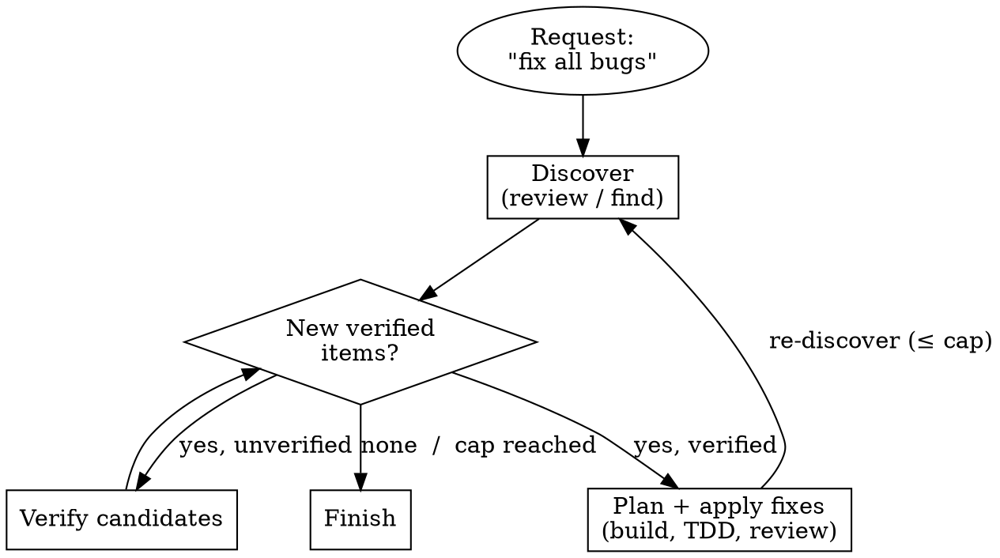

# Orchestrator Diligence Implementation Plan

> **For agentic workers:** REQUIRED SUB-SKILL: Use superpowers:subagent-driven-development (recommended) or superpowers:executing-plans to implement this plan task-by-task. Steps use checkbox (`- [ ]`) syntax for tracking.

**Goal:** Make the `orchestrate` agent structurally account for 100% of every request before delegating — enumerating every part (or committing to a convergent loop) at R0.5, carrying that accounting to merge, and back-stopping it with a completeness check.

**Architecture:** Import the "diligence" property from the abandoned programmatic-workflow-runtime experiment into master's native idiom — no runtime. A **Coverage Contract** extends the existing R0.5 Approach Proposal gate; a **convergent mode** lifts master's existing capped gate-loop pattern up to the top-level workflow; a global rule in `src/AGENTS.md` plus a Strict-Boundaries line anchor it structurally (the orchestrator is a weak free model — prose alone won't hold). Full rationale: `.docs/designs/design-2026-07-13-orchestrator-diligence.md`.

**Tech Stack:** Markdown agent/rule definitions (OpenCode), deployed to `~/.config/opencode/` via `install.sh`. No build system, **no test suite** — the artifacts are prose. Verification is **dogfooding (behavioral pressure scenarios) + static consistency checks**, not unit tests. Do not look for `npm test`/`pytest`; there is none.

## Global Constraints

- **No `.docs/rules/` for the guarantee.** `.docs/rules/` is project-local and undeployed (`install.sh` ships only `agents`, `plugins`, `skills`, `commands`, `AGENTS.md`, `CLAUDE.md`, `opencode.jsonc`). The diligence guarantee lives in `src/AGENTS.md` (global, deployed) + `src/agents/orchestrate.md` (agent body), never a repo-local rule file.
- **`src/CLAUDE.md` is a symlink → `src/AGENTS.md`.** Edit `AGENTS.md` only; never edit `CLAUDE.md` directly. Verify they stay identical (`diff src/AGENTS.md src/CLAUDE.md`).
- **Gates are plain messages, never the `question` tool** (`.docs/rules/explicit-over-implicit`). The Coverage Contract is confirmed in the plain-message Approach Proposal.
- **Accounting is mandatory; weight scales to the work.** Never let "complete coverage" become gold-plating of trivial tasks.
- **Preserve existing house style** — match the surrounding NO-list phrasing, table columns, and section conventions in each file. Do not reflow or restructure unrelated content.
- **Commit convention:** conventional commits (`feat(...)`, `docs(...)`, `fix(...)`), matching repo history.

---

### Task 1: Global diligence rule in `src/AGENTS.md`

The universal, deployed anchor — loaded every session including workers.

**Files:**
- Modify: `src/AGENTS.md` (insert a new section between `## Development Workflow` and `## Debugging`)
- Verify: `src/CLAUDE.md` (symlink — must remain identical)

**Interfaces:**
- Produces: the four-bullet diligence discipline that Tasks 2–5 operationalize in `orchestrate.md`. Later tasks reference these exact terms: **Coverage Contract**, **termination condition**, **safety cap**, **err toward thorough**, **accounting is mandatory; weight scales**.

- [ ] **Step 1: Pressure scenario (the gap this closes)**

Record the scenario the change must fix (used as the dogfood check in Task 6):
> Prompt: "Add request caching and a metrics counter." Current risk: the orchestrator implements caching, treats the task as done, and never accounts for the metrics counter — no structural rule forbids it.

- [ ] **Step 2: Insert the diligence section**

In `src/AGENTS.md`, immediately after the `## Development Workflow` section and before `## Debugging`, insert verbatim:

```markdown
## Diligence / Complete Coverage

The orchestrator accounts for the **whole** request before delegating any work, and carries that accounting through to completion.

- **Cover every part.** Every stated part of a request is enumerated and accounted for before any delegation; no part is silently dropped. "Do X and Y" is not satisfied by doing X.
- **Converge open-ended work.** A request with no enumerable end ("fix *all* the races", "get the suite green") commits up front to a loop with an explicit termination condition and a safety cap. A cap reached with items still open is surfaced to the human — never reported as done.
- **Err toward thorough.** When two readings are otherwise equal, take the more thorough one. Depth beyond that (extra research, verification, refinement) is *proposed* to the human, not imposed.
- **Accounting is mandatory; weight is not.** Always decompose the request; scale the *amount* of orchestration to the work. A one-line change gets a one-part accounting and a minimal workflow — completeness never means gold-plating a trivial task.
```

- [ ] **Step 3: Static verification**

Run and confirm expected output:

```bash
diff src/AGENTS.md src/CLAUDE.md && echo "SYMLINK IN SYNC"
grep -n "Diligence / Complete Coverage" src/AGENTS.md
```
Expected: `SYMLINK IN SYNC` (symlink resolves; content identical) and one grep hit. The section sits between Development Workflow and Debugging.

- [ ] **Step 4: Commit**

```bash
git add src/AGENTS.md
git commit -m "feat(agents): global diligence rule — complete coverage before delegation"
```

---

### Task 2: Coverage Contract at R0.5 (enumerable form) + Strict-Boundaries anchor

The forcing function: the existing R0.5 Approach Proposal cannot pass without an enumerated contract.

**Files:**
- Modify: `src/agents/orchestrate.md` — `## Strict Boundaries` list; `### Phase R0.5` (add classification + contract build + augmented proposal template)

**Interfaces:**
- Consumes: the diligence terms from Task 1.
- Produces: the **Coverage Contract** artifact shape (parts → planned node mapping; or loop+termination+cap) that Task 3 (convergent), Task 4 (ledger), and Task 5 (completeness check) all consume. The proposal template's contract block is the canonical format.

- [ ] **Step 1: Pressure scenario**
> Prompt: "Implement X and Y." Expected-after: R0.5's plain-message proposal enumerates *both* X and Y as parts, each mapped to a planned task, before any subagent is dispatched. Expected-before: no structural requirement to list Y.

- [ ] **Step 2: Add the Strict-Boundaries hard line**

In `src/agents/orchestrate.md`, in the `## Strict Boundaries` list, immediately after the `- NO silent routing …` bullet, insert:

```markdown
- NO delegation before a confirmed **Coverage Contract** — every part of the request enumerated and mapped to planned work (or, for open-ended work, a loop + termination condition + cap). A request is never satisfied by covering only some of its parts; a part is never dropped silently.
```

- [ ] **Step 3: Add classification + contract build to Phase R0.5**

In `### Phase R0.5`, immediately after the `**Form a recommendation** from the R0 read:` block (the bulleted workflow-selection list) and before `**Present the proposal**`, insert:

```markdown
**Classify the request shape — enumerable or convergent:**
- **Enumerable** — the parts can be listed up front ("add caching *and* metrics"). The contract lists them.
- **Convergent** — the parts are discovered by doing the work ("find and fix *all* races", "get the suite green"). The contract commits to a loop, not a part-list (see Convergent Mode in the Comprehensive lane).

**Build the Coverage Contract (mandatory — R0.5 cannot pass without it):**
- **Enumerable:** enumerate every atomic part of the request; add any implied work (research the unknowns, verify the result, refine); map each part → the planned node(s)/task(s) that will satisfy it. Default implied verification *in* for non-trivial parts (err toward thorough); depth beyond that is proposed, not assumed.
- **Convergent:** state the loop (discover → verify → act → re-discover), the **termination condition** (e.g. "a full re-discovery pass finds zero new *verified* items"), and a **safety cap** on iterations.
- Scale the contract to the work: a trivial one-part request gets a one-line contract, not ceremony. The accounting is always required; its size is not.
```

- [ ] **Step 4: Augment the proposal template**

In `### Phase R0.5`, replace the existing fenced proposal template:

```
Here's how I read this:
  • Type: <…>   • Size: <…>   • Risk: <…>
Recommended: <WORKFLOW> — <one-line why>
  Isolation: <new worktree | in place>   Shape: <phases; ~N tasks if known>
Proceed with <WORKFLOW>, or choose <the other options>?
```

with:

```
Here's how I read this:
  • Type: <…>   • Size: <…>   • Risk: <…>   • Shape: <enumerable | convergent>
Coverage Contract:
  1. <part> → <planned node/task>
  2. <part> → <planned node/task>
  + implied: <research / verify / refine, if any>
  (convergent instead of parts: loop <discover→verify→act> until <termination>; cap <N>)
Recommended: <WORKFLOW> — <one-line why>
  Isolation: <new worktree | in place>   Shape: <phases; ~N tasks if known>
Proceed with <WORKFLOW> and this contract, or adjust?
```

Then, immediately after that fenced block, insert:

```markdown
The confirmed contract is persisted to the SDD progress ledger when the workspace is created (≤ R2) and its checklist is carried to R4 — no part is marked done without evidence, and none is dropped. For a **Quick**-lane trivial task there is no ledger: the one-part contract is confirmed here and satisfied by the single build task's own verification.
```

- [ ] **Step 5: Static verification**

```bash
grep -n "Coverage Contract" src/agents/orchestrate.md
grep -n "enumerable\|convergent" src/agents/orchestrate.md
```
Expected: the Strict-Boundaries line, the R0.5 build block, and the template block all present; enumerable/convergent classification present. Read the R0.5 section start-to-finish once and confirm it reads coherently (no dangling references, the template still flows into mid-flow escalation).

- [ ] **Step 6: Commit**

```bash
git add src/agents/orchestrate.md
git commit -m "feat(orchestrate): Coverage Contract at R0.5 — enumerate every part before delegating"
```

---

### Task 3: Convergent mode in the Comprehensive lane

Lift master's existing capped gate-loop pattern up to the whole-workflow level for open-ended requests.

**Files:**
- Modify: `src/agents/orchestrate.md` — add a `### Convergent Mode (Comprehensive lane)` subsection after `### Phase R1d` and before `### Phase R2`

**Interfaces:**
- Consumes: the convergent classification + loop/termination/cap from Task 2's contract.
- Produces: the iteration/termination semantics Task 4 persists and Task 5 verifies ("was termination genuinely met, or the cap hit with items open?").

- [ ] **Step 1: Pressure scenario**
> Prompt: "Find and fix all bugs in the parser." Expected-after: R0.5 classifies convergent; the lane runs discover→verify→fix→re-discover, iterating until a clean discovery pass (or the cap), and a cap-hit with bugs remaining is surfaced — not reported as "done." Expected-before: a single review→fix pass declares victory.

- [ ] **Step 2: Insert the Convergent Mode subsection**

In `src/agents/orchestrate.md`, after `### Phase R1d: Plan Critique + Review Gates` and before `### Phase R2: Setup Worktree + Baseline`, insert:

````markdown
### Convergent Mode (Comprehensive lane)

When R0.5 classifies the request as **convergent**, the Comprehensive lane's plan→build→review cycle runs inside an outer convergence loop instead of as a single linear pass. This reuses the same capped loop-until-clean pattern the critique/review/dogfood gates already run — lifted from inside a gate to the whole workflow.

Each **iteration**:
1. **Discover** — dispatch `@research`/`@review` (or a build task in find-only mode) to surface candidate items (bugs, gaps, uncovered lines).
2. **Verify** — confirm each candidate is real before acting on it (avoids chasing false positives from a weak finder).
3. **Plan + apply** — plan the fixes, dispatch `@build` per fix (TDD), per-task review.
4. **Re-discover** — run the discovery pass again against the new state.

**Termination:** stop when a full re-discovery pass finds **zero new verified items** — the termination condition committed in the Coverage Contract. **Safety cap:** bound the iterations (mirrors the critique gate's 3-iteration cap; pick the cap in the contract). If the cap is reached with items still open, **surface that to the human as an explicit outcome** (raise cap / narrow scope / stop) — never report it as done. Track iteration count + the termination check in the SDD ledger (Task 4).


````

- [ ] **Step 3: Static verification**

```bash
grep -n "Convergent Mode" src/agents/orchestrate.md
grep -n "zero new verified items\|safety cap\|surface" src/agents/orchestrate.md
```
Expected: subsection present between R1d and R2; termination + cap + surface-on-cap language present; the `dot` block matches the cyclic-state-machine graphviz rule in `CLAUDE.md` (a back-edge loop — the one shape that earns a diagram).

- [ ] **Step 4: Commit**

```bash
git add src/agents/orchestrate.md
git commit -m "feat(orchestrate): convergent mode — loop open-ended requests to a termination condition"
```

---

### Task 4: Persist the Coverage Contract in the SDD ledger

Survive the weak model's #1 failure mode (lost context after compaction).

**Files:**
- Modify: `src/agents/orchestrate.md` — the `**Durable progress:**` bullet list under `### Phase R3`

**Interfaces:**
- Consumes: the contract shape (Task 2) and convergent iteration/termination semantics (Task 3).
- Produces: the on-disk ledger format the Task 5 completeness check reads.

- [ ] **Step 1: Pressure scenario**
> After a context compaction mid-build, the orchestrator must still know which parts of the request remain unaddressed. Expected-after: the ledger's Coverage Contract header + per-part status lines are the source of truth. Expected-before: only per-task completion lines exist; the original request decomposition is lost.

- [ ] **Step 2: Extend Durable progress**

In `### Phase R3`, in the `**Durable progress:**` bullet list, immediately after the bullet `- Maintain a progress ledger at \`.opencode/sdd/progress.md\``, insert these sub-bullets:

```markdown
- Write the confirmed **Coverage Contract** as a header block at the top of the ledger when the workspace is created (≤ R2): each enumerable part on its own status line (`- [ ] Part: <…> → <task(s)>`), updated to `- [x]` only after that part's work passes review. For a **convergent** request, record the loop, termination condition, and cap, then append one line per iteration (`Iteration N: <found> / <verified> / <fixed>; termination met? <yes/no>`).
- The contract header is the completeness source of truth: after compaction, trust it + `git log` over recollection to see what parts remain. No part flips to `[x]` without review evidence.
```

- [ ] **Step 3: Static verification**

```bash
grep -n "Coverage Contract\b" src/agents/orchestrate.md | head
grep -n "Iteration N:" src/agents/orchestrate.md
```
Expected: the ledger header instruction present under Durable progress; per-part checkbox format and convergent iteration-line format both specified.

- [ ] **Step 4: Commit**

```bash
git add src/agents/orchestrate.md
git commit -m "feat(orchestrate): persist Coverage Contract in the SDD ledger for compaction-safe coverage"
```

---

### Task 5: Completeness back-stop at the final review gate

Catch anything that slipped between plan and merge.

**Files:**
- Modify: `src/agents/orchestrate.md` — `### Phase R3b: Final Review Gate`
- Modify: `src/agents/review.md` — `## Whole-Branch Mode` → `### What to Check`

**Interfaces:**
- Consumes: the persisted Coverage Contract (Task 4).
- Produces: a Critical/Important finding for any unaddressed part, handled by the existing fix-loop.

- [ ] **Step 1: Pressure scenario**
> A branch implements X and (silently) skips Y from a two-part contract. Expected-after: the whole-branch review flags "Part Y unaddressed" as Critical and the fix-loop runs before merge. For a convergent request that hit its cap with bugs open, the review flags "termination not met." Expected-before: review checks plan-alignment but nothing pins it to the full request decomposition.

- [ ] **Step 2: orchestrate.md R3b — require the completeness check**

In `### Phase R3b: Final Review Gate (whole-branch)`, immediately after the `**Whole-branch review requests**` bullet list (the `Get commit range …` / `Dispatch @review …` / `Act on feedback …` bullets), insert:

```markdown
**Coverage completeness (mandatory):** pass the Coverage Contract from the ledger to `@review`, and require a completeness verdict — is **every** part of the contract addressed by the branch? An unaddressed part is a **Critical/Important** finding: dispatch a build subagent to close it, then re-review. For a **convergent** request, require confirmation that the **termination condition was genuinely met** — if the branch stopped because the safety cap was reached with items still open, that is surfaced to the human (raise cap / narrow / stop), never accepted as done. (For a single-task **Standard** feature whose per-task review is the review, apply this same completeness check there.)
```

- [ ] **Step 3: review.md — add the coverage check to whole-branch mode**

In `src/agents/review.md`, in `## Whole-Branch Mode (review_mode = whole-branch)` → `### What to Check`, immediately after the `**Plan alignment:**` bullet group, insert:

```markdown
**Coverage completeness (if a Coverage Contract is provided in your inputs):**
- Is every part listed in the contract addressed by the diff? An unaddressed or partially-addressed part is a **Critical** finding (missing requirement) — name the specific part.
- For a convergent contract: did the branch reach the stated **termination condition**, or did it stop at the **safety cap** with items still open? A cap-stop with open items is an **Important** finding to surface, not a pass.
```

Also, in `### Inputs` under Whole-Branch Mode, after the `- Minor issues list (optional): \`[MINOR_ISSUES_FILE]\`` line, insert:

```markdown
- Coverage Contract (optional): `[COVERAGE_CONTRACT]` — the request decomposition from the SDD ledger
```

- [ ] **Step 4: Static verification**

```bash
grep -n "Coverage completeness" src/agents/orchestrate.md src/agents/review.md
grep -n "termination condition" src/agents/review.md
```
Expected: completeness check present in both files; review.md's whole-branch inputs list the optional contract; language is consistent between the two (a part unaddressed = Critical/Important).

- [ ] **Step 5: Commit**

```bash
git add src/agents/orchestrate.md src/agents/review.md
git commit -m "feat(review): completeness back-stop — verify 100% Coverage Contract before merge"
```

---

### Task 6: Integration validation — deploy + dogfood both shapes

**Files:**
- No source edits. Runs `install.sh`; exercises the deployed orchestrator.

**Interfaces:**
- Consumes: all prior tasks.

- [ ] **Step 1: Deploy + static whole-file consistency**

```bash
bash install.sh
diff src/AGENTS.md src/CLAUDE.md && echo "SYMLINK OK"
```
Expected: install completes, commits the config snapshot, `SYMLINK OK`. No unresolved `{placeholder}`-style tokens introduced (`grep -n "<part>\|<termination>" src/agents/orchestrate.md` should only match inside the intended template/example blocks, not prose).

- [ ] **Step 2: Dogfood the enumerable shape**

This is the real acceptance and requires a live OpenCode session on the configured model (see memory `opencode-headless-testing`: `opencode run` needs `< /dev/null` + `--auto`, isolated `XDG_CONFIG_HOME`). Run the deployed orchestrator on:
> "Add an in-memory cache to the resolver and a counter that reports cache hits."

Expected observable: the R0.5 plain-message proposal contains a **Coverage Contract** enumerating *two* parts (cache; hit-counter), each mapped to planned work, before any `task` dispatch. Record the transcript under `.docs/reports/dogfood-2026-07-13-diligence.md`.

- [ ] **Step 3: Dogfood the convergent shape**

Run the deployed orchestrator on a small repo with a few known bugs:
> "Find and fix all the bugs in this module."

Expected observable: R0.5 classifies **convergent** and commits to a loop + termination condition + cap; execution iterates discover→verify→fix→re-discover; the ledger shows `Iteration N:` lines; a clean discovery pass terminates it (or a cap-hit is surfaced, not silently closed). Append to the same dogfood report.

- [ ] **Step 4: Handle findings**

Any scenario that fails its expected observable is a defect in the prose — treat with `systematic-debugging` (trace *which* instruction the weak model missed; the fix is usually sharper structural phrasing, not more prose). Re-deploy and re-run the failing scenario only.

> If a live dogfood session is not available in this environment, mark Steps 2–3 as **deferred-to-user** in the dogfood report with the exact prompts + expected observables above, so they can be run interactively. Do **not** claim behavioral validation that wasn't observed (`.docs/rules`/AGENTS.md: no completion claims without verification).

- [ ] **Step 5: Commit the dogfood report**

```bash
git add .docs/reports/dogfood-2026-07-13-diligence.md
git commit -m "docs(report): diligence dogfood — enumerable + convergent shapes"
```

---

## Self-Review

**Spec coverage** (design §→task):
- §1 Definition (two shapes) → Task 1 (rule) + Task 2 (classification).
- §2 Enumerable Coverage Contract → Task 2.
- §3 Convergent mode → Task 3.
- §4 Proportionality resolution → Task 1 (bullet 4) + Task 2 ("scale the contract"; err-thorough default).
- §5 Back-stop completeness critic → Task 5.
- §6 Structural anchor (AGENTS.md + Strict Boundaries) → Task 1 + Task 2 Step 2.
- §7 Persisted ledger → Task 4.
- Edge cases: lazy contract → Task 5 (critic) + Task 2 ("atomic parts"); non-convergence → Task 3 (surface cap-hit) + Task 5; trivial request → Task 2 Step 4 (Quick-lane, no ceremony); mid-flow growth → covered by orchestrate.md's existing mid-flow escalation gate (contract amended via Approach Proposal — note in Task 2); under-scoping → Task 1 ("proposed, not imposed").

**Placeholder scan:** No "TBD"/"implement later". `<part>`/`<termination>` tokens appear only inside intended template/example fences (Task 2 Step 4, Task 6 Step 1) — they are template placeholders in the *product*, not plan gaps.

**Consistency:** "Coverage Contract", "termination condition", "safety cap", "err toward thorough" used identically across Tasks 1–5. Ledger format defined in Task 4 is the exact artifact Task 5 reads. review.md input name `[COVERAGE_CONTRACT]` matches the R3b instruction to "pass the Coverage Contract from the ledger."

**One gap fixed inline:** Task 2 Step 4's trailing note now covers the Quick-lane no-ledger case (so Task 4/5's ledger dependency doesn't strand trivial tasks).
