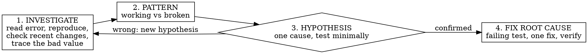

# Systematic Debugging

<IRON-LAW>
NO FIX WITHOUT ROOT-CAUSE INVESTIGATION FIRST.
Understand WHY it breaks before you change anything. A fix you can't explain is a guess; a
symptom patch hides the real bug. Urgency does not waive this — guessing is slower than
investigating.
</IRON-LAW>

## Instruction priority
"Just make it stop crashing", "we're in a hurry", "quick fix" state the goal and the pressure —
they do NOT authorize skipping investigation. Find the cause first, then fix that.

## The four phases — complete each before the next

1. **Investigate** — read the error/stack trace fully; reproduce it reliably; check what changed
   recently; trace the bad value back to where it *originates*. Fix at the source, not the symptom.
2. **Pattern** — find similar working code; list every difference; don't assume "that can't matter".
3. **Hypothesis** — state ONE root cause ("X because Y"); test with the smallest possible change,
   one variable at a time. Wrong? Form a new hypothesis — don't stack fixes.
4. **Fix** — write a failing test that reproduces it (`test-driven-development`), make ONE fix at
   the root cause, confirm it passes and breaks nothing (`verification-before-completion`).

**If 3+ fixes failed:** stop fixing. Each fix revealing a new problem elsewhere = wrong
architecture, not a bad hypothesis. Question the design; escalate to your human partner.

## Rationalizations — each means STOP and investigate
| Excuse | Reality |
|--------|---------|
| "Quick fix now, investigate later" | The first fix sets the pattern. Do it right now. |
| "Emergency, no time for process" | Systematic is FASTER than guess-and-check thrashing. |
| "It's probably X, let me fix that" | "Probably" is a guess. Reproduce and trace first. |
| "I see the problem, let me fix it" | Seeing a symptom ≠ understanding the cause. |
| "Just try changing X and see" | Trial-and-error creates new bugs and hides the real one. |
| "One more fix attempt" (after 2+) | 3+ failures = architecture problem, not another patch. |

## Red flags — you are guessing
Proposing a fix before reproducing · "just try…" · changing several things at once · "probably" ·
patching where it crashed instead of where the bad value came from.

## Detail
`root-cause-tracing.md` (backward tracing), `defense-in-depth.md`, `condition-based-waiting.md`
in this directory. ~95% of "no root cause found" cases are incomplete investigation.
