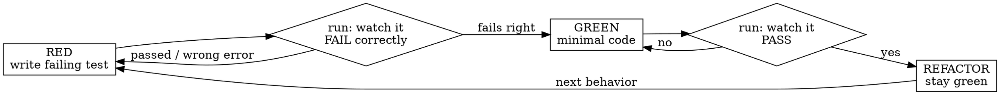

# Test-Driven Development

<IRON-LAW>
NO PRODUCTION CODE WITHOUT A FAILING TEST FIRST.
This defines HOW you work. A feature request, urgency, or "just add it" does NOT waive it.
Wrote code before the test? Delete it and start from the test.
</IRON-LAW>

## Instruction priority
The user says WHAT to build ("add isEven", "ship retry now"); this skill says HOW: test first.
"Urgent", "prod is down", "just add it", "it's trivial" are WHAT + pressure — none of them
authorize skipping the test. Write the test first anyway.

## The cycle — RED → GREEN → REFACTOR

1. **RED** — write ONE minimal test naming the behavior. Run it. Confirm it FAILS because the
   code is missing (not a typo). Didn't watch it fail? You don't know it tests anything.
2. **GREEN** — simplest code that passes. No extra features (YAGNI).
3. **REFACTOR** — clean up while staying green.

## Rationalizations — each means STOP and write the test first
| Excuse | Reality |
|--------|---------|
| "We're in a hurry / prod is down" | Test-first IS the fast path; debugging untested code is slower. |
| "User told me to just add it / skip it" | User controls WHAT, not HOW. Test-first still applies. |
| "It's too simple / trivial to test" | Trivial code breaks too. The test takes 20 seconds. |
| "I'll write the test after" | A test written after passes immediately — it proves nothing; you never saw it fail. |
| "I already manually tested it" | Ad-hoc, no record, can't re-run. Not a test. |
| "Deleting my code is wasteful" | Sunk cost. Unverified code is the waste — delete, redo from the test. |

## Red flags — all mean: delete the code, start from the test
Code before test · test passes on the first run · "test it later" · "just this once" ·
"this is different because…"

## Done means
Every new behavior has a test you watched fail, then pass, with pristine output — otherwise
it is not TDD. See [testing-anti-patterns.md](testing-anti-patterns.md) before adding mocks.
